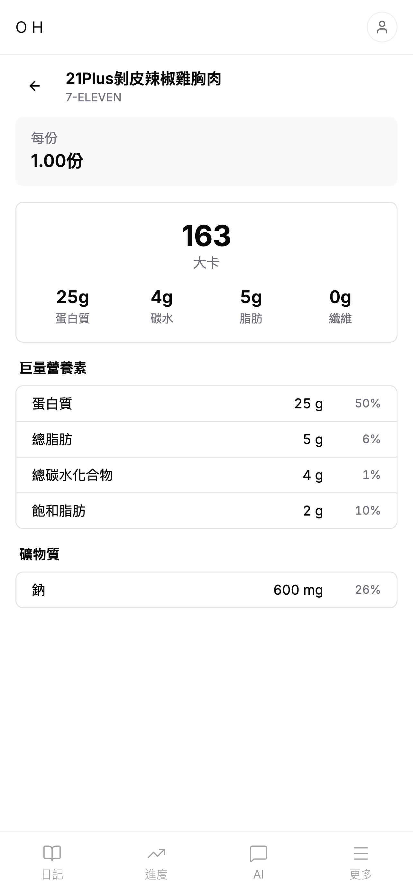
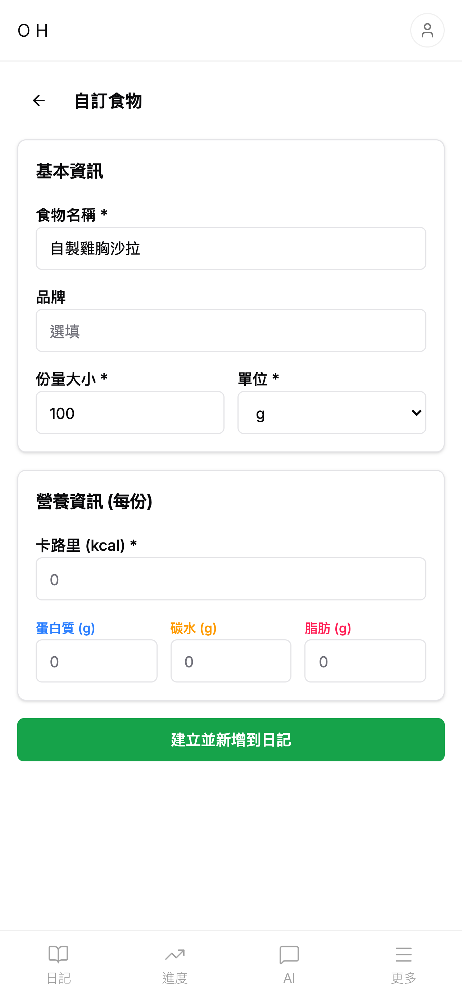
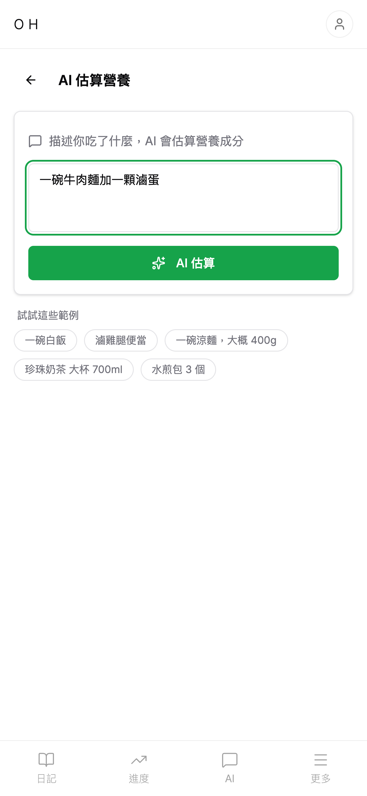
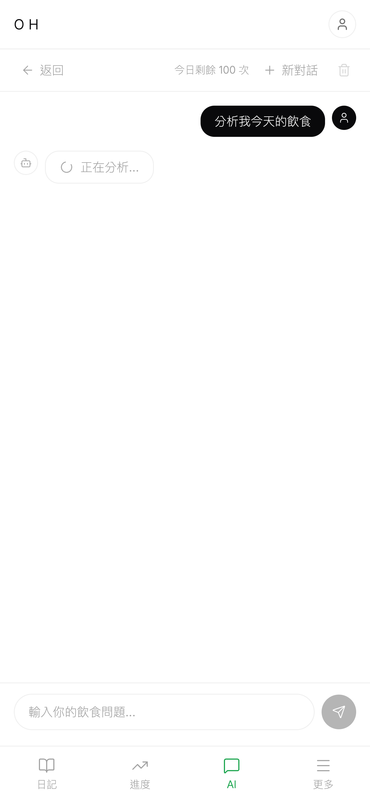

# Open Health

All-in-One Health OS — 開放的健康作業系統。飲食、運動、睡眠、體重，一個開源平台全部搞定。

> [openhealth.blog](https://openhealth.blog)

## Screenshots

<p align="center">
  
  
  
  
</p>
<p align="center">
  
  
  
  
</p>

## Features

### 追蹤
- [x] **飲食日記** — 記錄每餐食物，自動計算卡路里與三大營養素
- [x] **食物資料庫** — 搜尋常見食物，支援自訂食物與收藏
- [x] **飲水紀錄** — 追蹤每日飲水量、目標設定、歷史記錄
- [x] **體重紀錄** — 每日體重記錄與趨勢分析
- [x] **睡眠追蹤** — 記錄就寢與起床時間、睡眠品質
- [x] **間歇斷食** — 計時器與斷食歷史記錄

### AI
- [x] **AI 營養標籤掃描** — 拍照辨識營養標籤，快速輸入食物資料
- [x] **AI 營養顧問** — 分析飲食紀錄，提供個人化營養建議

### 平台
- [x] **進度追蹤** — 視覺化追蹤熱量、營養素與體重趨勢
- [x] **深色模式** — 支援淺色與深色主題
- [x] **Google / Apple OAuth** — 社群帳號快速登入
- [x] **PWA** — 安裝到主畫面，支援推播通知
- [x] **Mobile App** — Expo React Native 原生 app（iOS / Android）

## Roadmap

- [ ] **i18n 中英雙語** — 支援繁體中文 / English 切換（見下方實作計畫）
- [ ] **運動記錄** — 有氧與重訓追蹤
- [ ] **條碼掃描** — 掃描食品條碼自動帶入營養資訊
- [ ] **匯出報告** — 匯出每週/每月健康報告
- [ ] **第三方整合** — Apple Health、Google Fit 資料同步

## i18n Implementation Plan

使用 `react-i18next` + `i18next` 實現中英雙語，翻譯檔集中在 `packages/shared`，Web 與 Mobile 共用。

### Phase 1 — 基礎設施
- [ ] 安裝 `i18next`、`react-i18next`（web + mobile）、`i18next-browser-languagedetector`（web）、`expo-localization`（mobile）
- [ ] 建立 `packages/shared/src/i18n/` 翻譯檔結構（`locales/zh-TW/`、`locales/en/`）
- [ ] 建立共用 i18n config（`supportedLngs`、`fallbackLng`、`resources` 匯出）
- [ ] Web：初始化 i18n（`apps/web/src/lib/i18n.ts`）並整合到 Providers
- [ ] Mobile：初始化 i18n（`apps/mobile/lib/i18n.ts`）並整合到 `_layout.tsx`
- [ ] 加入 TypeScript 型別定義（`i18next.d.ts`）讓 `t()` key 有自動補全

### Phase 2 — 共用元件翻譯
- [ ] 導航列（Header、BottomNav、Tab Navigator）
- [ ] 通用 UI：按鈕文字（儲存/取消/刪除/確認）、toast 訊息、空狀態、loading
- [ ] 語言切換 UI（設定頁加入語言選擇）

### Phase 3 — 各模組頁面翻譯（Web）
- [ ] 日記模組（diary）
- [ ] 食物模組（food search、detail、create）
- [ ] 運動模組（exercise）
- [ ] 睡眠模組（sleep）
- [ ] 飲水模組（water）
- [ ] 體重模組（weight）
- [ ] 進度模組（progress）
- [ ] 設定模組（settings、profile、referral）
- [ ] AI 功能（chat、nutrition label scan、estimate）

### Phase 4 — Shared 常數遷移
- [ ] `NUTRIENT_NAME_ZH`（50+ 營養素）→ `nutrients.json`
- [ ] `EXERCISE_CATEGORY_LABELS`、`EXERCISE_INTENSITY_LABELS` → `exercise.json`
- [ ] `SLEEP_PHASE_LABELS`、`SLEEP_FACTORS` → `sleep.json`
- [ ] `SET_TYPE_LABELS` → `exercise.json`
- [ ] `NUTRIENT_CATEGORY_LABELS` → `nutrients.json`

### Phase 5 — Mobile 頁面翻譯
- [ ] Tab 頁面（日記、食物、進度、設定）
- [ ] 各功能畫面（同 Phase 3 範圍）
- [ ] `app.config.ts` 權限描述文字

### Phase 6 — 收尾
- [ ] `date-fns` locale 連動（根據語言切換日期格式）
- [ ] HTML `lang` 屬性動態更新
- [ ] SEO metadata 多語言（`layout.tsx` 的 title/description）
- [ ] 驗證所有頁面中英文顯示正確、無破版

### 技術決策
- **不做 locale routing**（`/en/diary`）— 這是工具型 app，語言跟隨用戶偏好，不需 SEO 多語言索引
- **預設語言：zh-TW**，fallback 也是 zh-TW
- **語言偵測**：Web 用 `localStorage` + `navigator.language`；Mobile 用 `expo-localization` + `SecureStore`
- **翻譯量估計**：約 800-1200 個 key

## Tech Stack

| Layer | Technology |
|-------|-----------|
| Web | Next.js 15, TypeScript, Tailwind CSS v4, shadcn/ui |
| Mobile | Expo SDK 52, React Native, NativeWind |
| Backend | tRPC v11, Server Actions, PostgreSQL, Drizzle ORM |
| Auth | Better Auth (email/password + Google + Apple OAuth) |
| AI | Google Gemini 2.5 Flash (nutrition label OCR, chat) |
| Monorepo | Turborepo + pnpm workspaces |

## Project Structure

```
open-health/
├── apps/
│   ├── web/          # Next.js web app
│   └── mobile/       # Expo React Native app
├── packages/
│   └── shared/       # Shared types, schemas, utils
├── scripts/
│   └── app-store-screenshots/   # App Store screenshot generator
└── turbo.json
```

## Getting Started

```bash
# Install dependencies
pnpm install

# Run all apps
pnpm dev

# Run specific app
pnpm dev:web       # localhost:3001
pnpm dev:mobile    # Expo dev server
```

## Scripts

### App Store Screenshots

Generate iPhone 6.5" display screenshots (1284 x 2778px) for App Store Connect:

```bash
# Prerequisites
pip install playwright
playwright install chromium

# Generate screenshots
python scripts/app-store-screenshots/take-screenshots.py

# Also copy to web/public for landing page
python scripts/app-store-screenshots/take-screenshots.py --copy-to-web

# Take additional screenshots (food detail, create, AI estimate, AI chat)
python scripts/app-store-screenshots/take-extra-screenshots.py
```

Output: `scripts/app-store-screenshots/output/`

| File | Content |
|------|---------|
| `01-diary.png` | 飲食日記（含食物紀錄） |
| `02-food-search.png` | 食物搜尋結果 |
| `03-ai-chat.png` | AI 營養顧問 |
| `04-progress.png` | 進度追蹤 |
| `05-landing.png` | 首頁（未登入） |
| `06-food-detail.png` | 食物營養詳情 |
| `07-food-create.png` | 新增自訂食物 |
| `08-ai-estimate.png` | AI 飲食估算 |
| `09-ai-chat-conversation.png` | AI 營養顧問對話 |

Environment variables (optional):
- `BASE_URL` — target URL (default: `https://openhealth.blog`)
- `DEMO_EMAIL` / `DEMO_PASSWORD` — demo account credentials

## Docs

- [SEO Todo](docs/seo-todo.md) — SEO 待办事项与传播策略

## License

MIT
