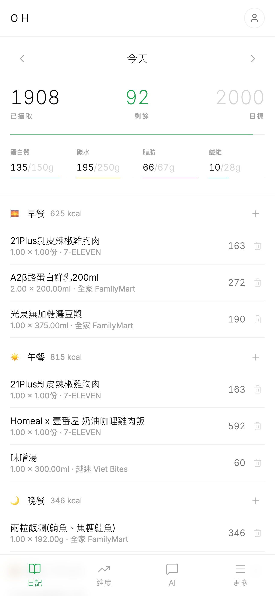
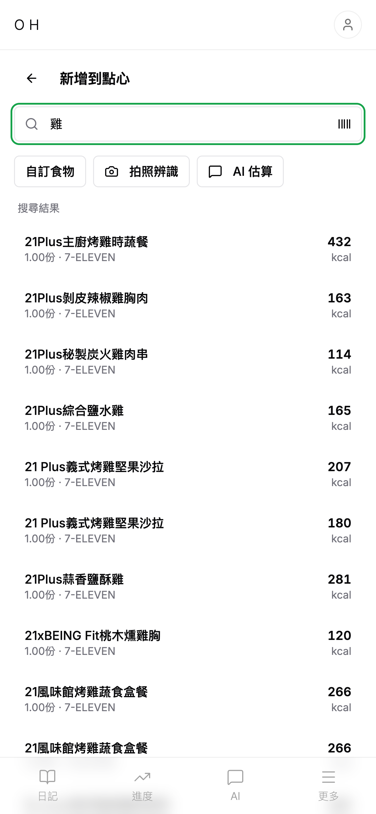
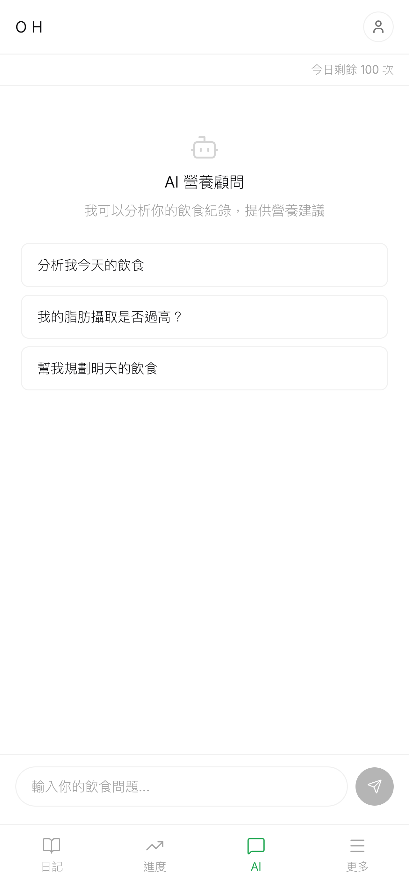
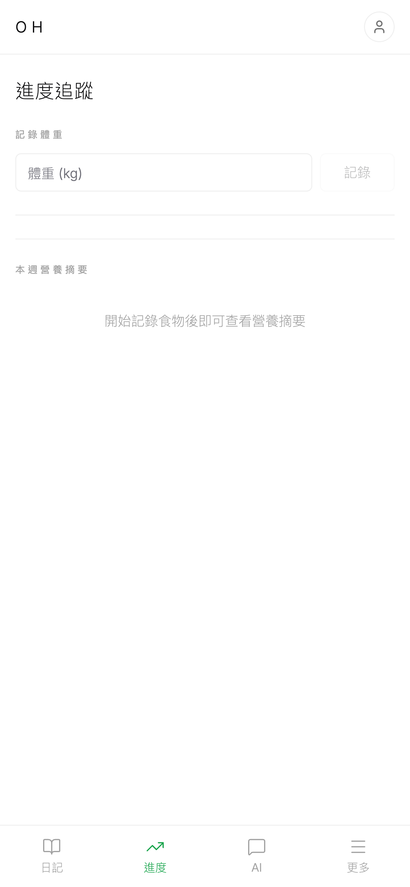

# Open Health

開源、免費的飲食與營養追蹤平台。

> [openhealth.blog](https://openhealth.blog)

## Screenshots

<p align="center">
  
  
  
  
</p>

## Features

- **飲食日記** — 記錄每餐食物，自動計算卡路里與三大營養素
- **食物資料庫** — 搜尋常見食物，支援自訂食物與收藏
- **AI 營養標籤掃描** — 拍照辨識營養標籤，快速輸入食物資料
- **AI 營養顧問** — 分析飲食紀錄，提供營養建議
- **進度追蹤** — 視覺化追蹤熱量、營養素與體重
- **飲水紀錄** — 追蹤每日飲水量
- **深色模式** — 支援淺色與深色主題

## Tech Stack

| Layer | Technology |
|-------|-----------|
| Web | Next.js 15, TypeScript, Tailwind CSS v4, shadcn/ui |
| Mobile | Expo SDK 52, React Native, NativeWind |
| Backend | tRPC v11, Server Actions, PostgreSQL, Drizzle ORM |
| Auth | Better Auth (email/password + Google + Apple OAuth) |
| AI | Google Gemini 2.5 Flash (nutrition label OCR, chat) |
| Monorepo | Turborepo + pnpm workspaces |

## Project Structure

```
open-health/
├── apps/
│   ├── web/          # Next.js web app
│   └── mobile/       # Expo React Native app
├── packages/
│   └── shared/       # Shared types, schemas, utils
├── scripts/
│   └── app-store-screenshots/   # App Store screenshot generator
└── turbo.json
```

## Getting Started

```bash
# Install dependencies
pnpm install

# Run all apps
pnpm dev

# Run specific app
pnpm dev:web       # localhost:3001
pnpm dev:mobile    # Expo dev server
```

## Scripts

### App Store Screenshots

Generate iPhone 6.5" display screenshots (1284 × 2778px) for App Store Connect:

```bash
# Prerequisites
pip install playwright
playwright install chromium

# Generate screenshots
python scripts/app-store-screenshots/take-screenshots.py

# Also copy to web/public for landing page
python scripts/app-store-screenshots/take-screenshots.py --copy-to-web
```

Output: `scripts/app-store-screenshots/output/`

| File | Content |
|------|---------|
| `01-diary.png` | 飲食日記（含食物紀錄） |
| `02-food-search.png` | 食物搜尋結果 |
| `03-ai-chat.png` | AI 營養顧問 |
| `04-progress.png` | 進度追蹤 |
| `05-landing.png` | 首頁（未登入） |

Environment variables (optional):
- `BASE_URL` — target URL (default: `https://openhealth.blog`)
- `DEMO_EMAIL` / `DEMO_PASSWORD` — demo account credentials

## License

MIT
