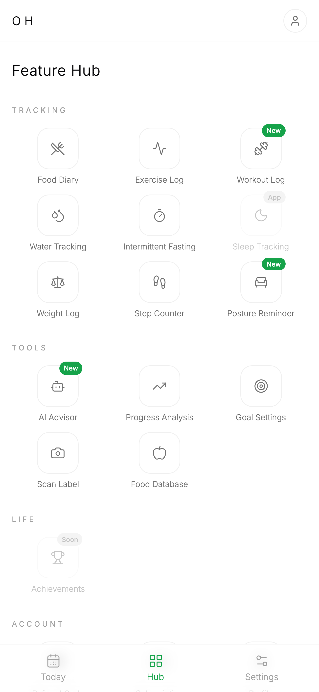
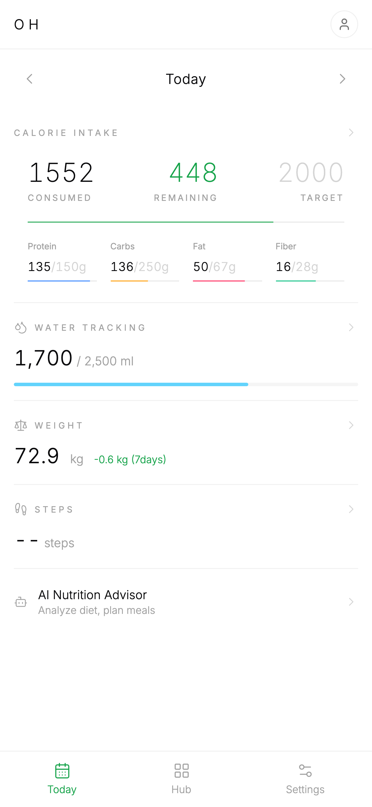
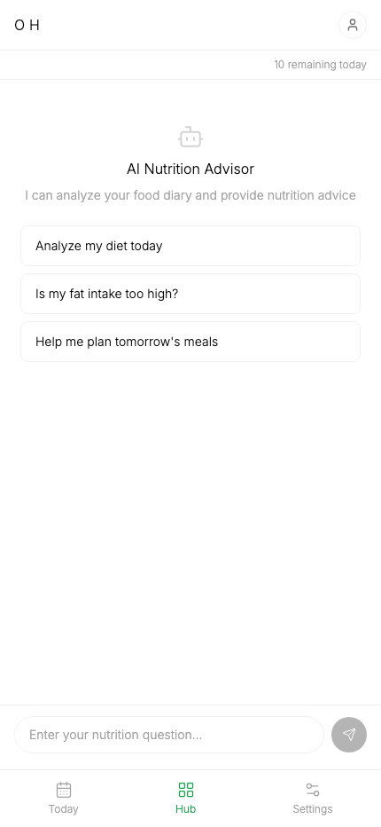
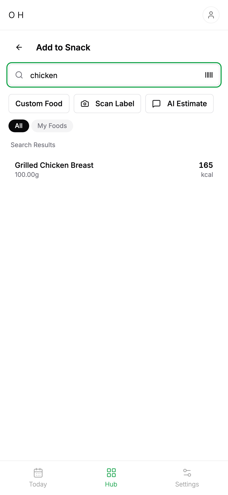
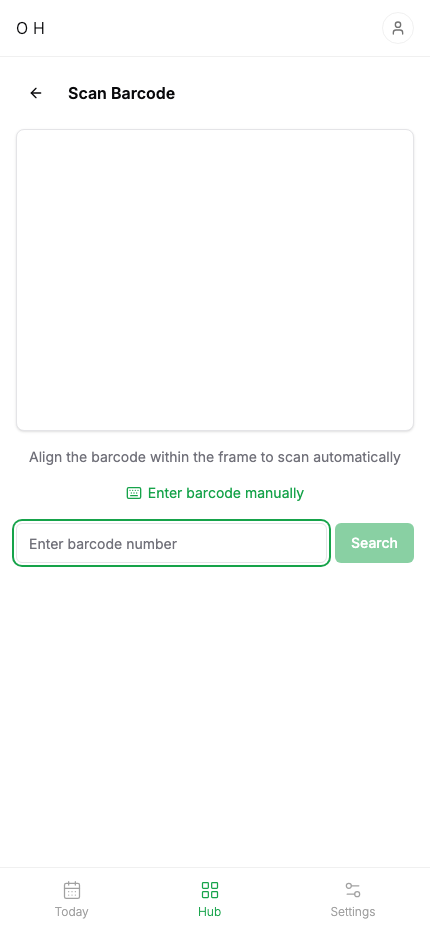
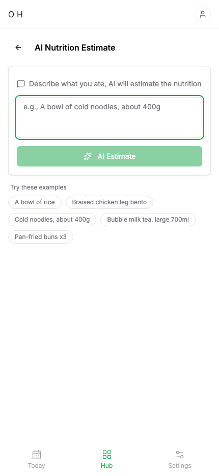
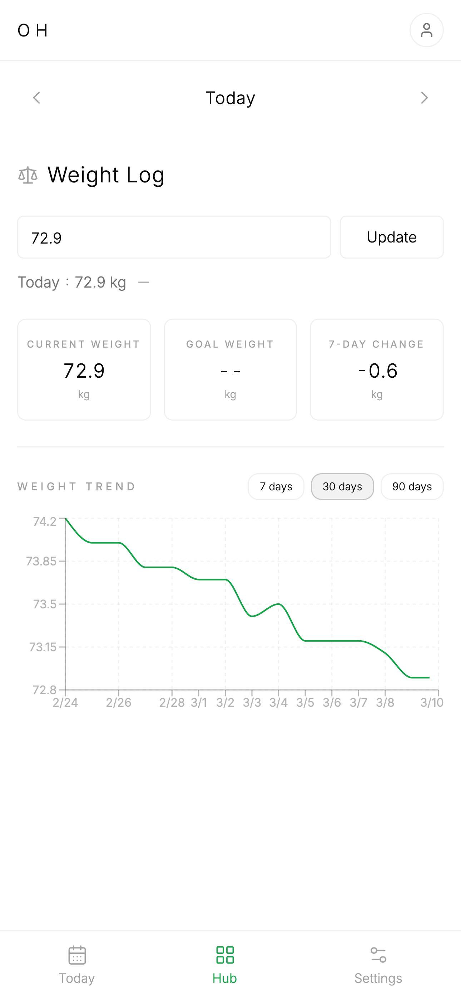
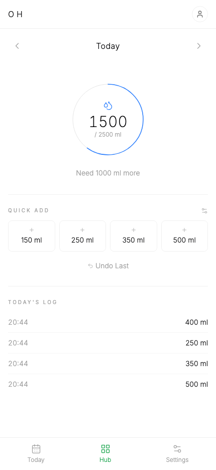

<p align="center">
  <h1 align="center">Open Health</h1>
  <p align="center">
    All-in-One Health OS — open-source, self-hostable health tracking platform.
    <br />
    <a href="https://openhealth.blog">Live Demo</a> · <a href="https://openhealth.blog">官方網站</a> · <a href="#self-hosting">Self-Host Guide</a>
  </p>
</p>

<p align="center">
  <a href="LICENSE"></a>
  <a href="https://github.com/truenorth-lj/openhealth/stargazers"></a>
</p>

Track nutrition, water intake, weight, sleep, exercise, and intermittent fasting — all in one place. Built with Next.js, PostgreSQL, and AI-powered features.

> **繁體中文** | Open Health 是一個開源的全方位健康追蹤平台。飲食、飲水、體重、睡眠、運動、間歇斷食，一個平台全部搞定。支援 AI 營養標籤掃描與個人化營養建議。

## Screenshots

<p align="center">
  
  
  
  
</p>
<p align="center">
  
  
  
  
</p>

## Features

### Tracking
- **Food Diary** — log meals with automatic calorie & macro calculation (自動計算卡路里與三大營養素)
- **Food Database** — search common foods, create custom foods, save favorites
- **Water Intake** — daily water tracking with goals and history (飲水紀錄)
- **Weight Tracking** — daily weight log with trend analysis (體重趨勢分析)
- **Sleep Tracking** — bedtime, wake time, and sleep quality (睡眠追蹤)
- **Intermittent Fasting** — timer with fasting history (間歇斷食計時器)
- **Exercise** — cardio & strength training log (運動記錄)

### AI-Powered
- **Nutrition Label Scanner** — take a photo, AI extracts nutrition data (AI 營養標籤掃描)
- **AI Nutrition Chat** — personalized nutrition advice based on your diary (AI 營養顧問)
- **AI Meal Estimate** — describe a meal, AI estimates calories & macros

### Platform
- **Progress Dashboard** — visualize calories, nutrients, and weight trends
- **Dark Mode** — light and dark theme support
- **PWA** — install to home screen with push notifications
- **i18n** — English and Traditional Chinese (繁體中文)
- **Google / Apple OAuth** — social login support

## Tech Stack

| Layer | Technology |
|-------|-----------|
| Framework | [Next.js 15](https://nextjs.org/) (App Router), TypeScript, React 19 |
| Styling | [Tailwind CSS v4](https://tailwindcss.com/), [shadcn/ui](https://ui.shadcn.com/) |
| Database | PostgreSQL + [Drizzle ORM](https://orm.drizzle.team/) |
| API | [tRPC v11](https://trpc.io/) (reads) + Server Actions (writes) |
| Auth | [Better Auth](https://www.better-auth.com/) (email/password + OAuth) |
| AI | Google Gemini 2.5 Flash (OCR, chat) |
| Payments | Stripe |
| Monorepo | [Turborepo](https://turbo.build/) + pnpm workspaces |

## Project Structure

```
openhealth/
├── apps/web/              # Next.js web app
│   ├── src/
│   │   ├── app/           # App Router pages
│   │   ├── components/    # React components
│   │   ├── server/        # tRPC routers, Server Actions, DB
│   │   └── lib/           # Utilities, auth, tRPC client
│   └── public/            # Static assets
├── packages/
│   ├── shared/            # Shared types, Zod schemas, i18n, utils
│   └── db/                # Drizzle schema, migrations
├── Dockerfile
├── docker-compose.yml     # One-click self-hosting
└── turbo.json
```

## Getting Started

### Prerequisites

- Node.js 22+
- pnpm 10+
- PostgreSQL 16+

### Local Development

```bash
# Clone the repo
git clone https://github.com/truenorth-lj/openhealth.git
cd openhealth

# Install dependencies
pnpm install

# Set up environment variables
cp .env.example apps/web/.env.local
# Edit apps/web/.env.local with your DATABASE_URL and BETTER_AUTH_SECRET

# Start the dev server
pnpm dev:web
# Open http://localhost:3001
```

### Self-Hosting

The fastest way to run Open Health is with Docker:

```bash
git clone https://github.com/truenorth-lj/openhealth.git
cd openhealth

# Start PostgreSQL + web app
docker compose up -d

# Open http://localhost:3000
```

That's it. The database migrations run automatically on startup.

#### Environment Variables

| Variable | Required | Description |
|----------|----------|-------------|
| `DATABASE_URL` | Yes | PostgreSQL connection string |
| `BETTER_AUTH_SECRET` | Yes | Random string for session encryption |
| `BETTER_AUTH_URL` | Yes | Your app's URL |
| `GOOGLE_CLIENT_ID` / `SECRET` | No | Google OAuth login |
| `APPLE_CLIENT_ID` / `SECRET` | No | Apple OAuth login |
| `GOOGLE_AI_API_KEY` | No | Enables AI features (Gemini) |
| `STRIPE_SECRET_KEY` | No | Enables payment / Pro plan |
| `NEXT_PUBLIC_VAPID_PUBLIC_KEY` | No | Enables push notifications |

See [`.env.example`](.env.example) for the full list.

## Roadmap

- [ ] Barcode scanning for packaged foods (條碼掃描)
- [ ] Weekly/monthly health reports export (匯出健康報告)
- [ ] Apple Health / Google Fit sync (第三方健康數據同步)
- [ ] Multi-language expansion beyond EN/zh-TW

## Contributing

Contributions are welcome! Please feel free to submit a Pull Request.

```bash
# Run tests
pnpm test

# Run linter
pnpm lint

# Build
pnpm build
```

## License

[MIT](LICENSE)

---

Built with Next.js, PostgreSQL, and AI. Made in Taiwan.
